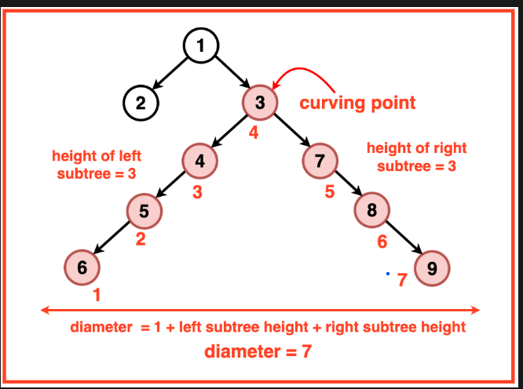

## Concept

Length of longest path passing via a node=
LeftHeight + RightHeight

To find the diameter of a binary tree, we can think of every node as a potential `Curving Point` of the diameter path. This Curving Point is the node along the diameter path that holds the maximum height and from where the path curves uphill and downhill.

## Approach

1. **Recursion**:
   - Dive into the tree using recursion to find the height of each subtree.
   - At every node, calculate the diameter as the sum of the left and right heights.
   - Keep updating the maximum diameter as you traverse.

### Time Complexity

- **O(n)**: We explore every node exactly once.

### Space Complexity

- **O(h)**: Space depends on the tree height for recursion.

## Example Code

#include <algorithm>
using namespace std;

struct TreeNode {
    int val;
    TreeNode *left;
    TreeNode *right;
    TreeNode(int x) : val(x), left(nullptr), right(nullptr) {}
};

class Solution {
public:
    int height(TreeNode* root, int &diameter) {
        if (root==nullptr) return 0;
        int lh = height(root->left, diameter);
        int rh = height(root->right, diameter);
        diameter = max(diameter, lh + rh);
        return 1 + max(lh, rh);
    }

    int diameterOfBinaryTree(TreeNode* root) {
        int diameter = 0;
        height(root, diameter);
        return diameter;
    }
};